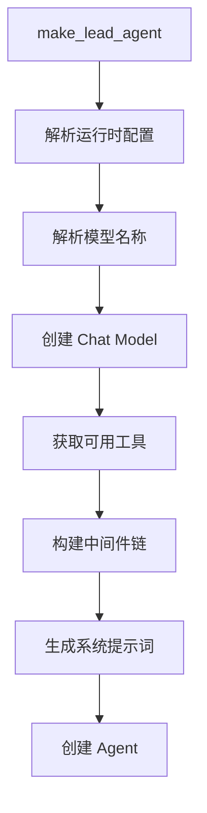

# DeerFlow Lead Agent 详细分析

## 概述

Lead Agent 是 DeerFlow 系统的核心主代理，负责协调所有中间件、工具和子代理来完成用户任务。它基于 LangGraph Agent 架构构建，通过中间件链实现了模块化、可扩展的 Agent 系统。

**文件位置**: `packages/harness/deerflow/agents/lead_agent/`

**核心文件**:
- `agent.py` - Agent 工厂函数和中间件链构建
- `prompt.py` - 系统提示词模板和动态内容生成

---

## 核心架构

### Agent 工厂函数

```python
def make_lead_agent(config: RunnableConfig):
    """创建 Lead Agent 的主工厂函数

    Args:
        config: 运行时配置，包含可配置选项

    Returns:
        配置好的 Agent 实例
    """
```

**执行流程**:



---

## 配置解析

### 1. 模型名称解析

**函数**: `_resolve_model_name(requested_model_name: str | None = None) -> str`

**解析优先级**:
1. **请求的模型名** (`requested_model_name`) - 来自运行时配置
2. **Agent 配置的模型** (`agent_config.model`) - 来自 agents_config.yaml
3. **全局默认模型** (`app_config.models[0]`) - 来自 config.yaml

**实现逻辑**:
```python
def _resolve_model_name(requested_model_name: str | None = None) -> str:
    # 1. 获取应用配置
    app_config = get_app_config()
    default_model_name = app_config.models[0].name if app_config.models else None

    # 2. 检查是否有可用模型
    if default_model_name is None:
        raise ValueError("No chat models are configured...")

    # 3. 验证请求的模型是否存在
    if requested_model_name and app_config.get_model_config(requested_model_name):
        return requested_model_name

    # 4. 回退到默认模型
    if requested_model_name and requested_model_name != default_model_name:
        logger.warning(f"Model '{requested_model_name}' not found...")

    return default_model_name
```

### 2. 运行时配置提取

```python
cfg = config.get("configurable", {})

# 核心参数
thinking_enabled = cfg.get("thinking_enabled", True)         # 思维模式开关
reasoning_effort = cfg.get("reasoning_effort", None)        # 推理强度
requested_model_name = cfg.get("model_name") or cfg.get("model")
is_plan_mode = cfg.get("is_plan_mode", False)               # 计划模式
subagent_enabled = cfg.get("subagent_enabled", False)       # 子代理开关
max_concurrent_subagents = cfg.get("max_concurrent_subagents", 3)  # 最大并发数
is_bootstrap = cfg.get("is_bootstrap", False)               # 启动模式
agent_name = cfg.get("agent_name")                          # Agent 名称
```

### 3. LangSmith 元数据注入

```python
# 注入运行元数据用于 LangSmith 追踪
config["metadata"] = {
    "agent_name": agent_name or "default",
    "model_name": model_name or "default",
    "thinking_enabled": thinking_enabled,
    "reasoning_effort": reasoning_effort,
    "is_plan_mode": is_plan_mode,
    "subagent_enabled": subagent_enabled,
}
```

---

## 中间件链构建

### 构建函数

**函数**: `_build_middlewares(config: RunnableConfig, model_name: str | None, agent_name: str | None = None)`

**中间件顺序**（严格遵守依赖关系）:

```python
# 阶段 1: 基础设施层（来自 build_lead_runtime_middlewares）
middlewares = [
    ThreadDataMiddleware,     # 创建线程目录
    UploadsMiddleware,       # 跟踪上传文件
    SandboxMiddleware,       # 获取沙箱环境
    DanglingToolCallMiddleware,  # 修复悬挂工具调用
    GuardrailMiddleware,     # 工具调用授权（可选）
    ToolErrorHandlingMiddleware,  # 工具异常处理
]

# 阶段 2: 优化和增强层（条件性）
# SummarizationMiddleware（如果启用）
if summarization_config.enabled:
    middlewares.append(SummarizationMiddleware())

# TodoListMiddleware（如果 plan_mode）
if is_plan_mode:
    middlewares.append(TodoMiddleware())

# TokenUsageMiddleware（如果启用）
if token_usage_config.enabled:
    middlewares.append(TokenUsageMiddleware())

# 阶段 3: 生成和记录层
middlewares.extend([
    TitleMiddleware,      # 自动生成标题
    MemoryMiddleware,    # 队列化记忆更新
])

# 阶段 4: 特殊功能层（条件性）
# ViewImageMiddleware（仅视觉模型）
if model_config.supports_vision:
    middlewares.append(ViewImageMiddleware())

# DeferredToolFilterMiddleware（如果 tool_search）
if tool_search_config.enabled:
    middlewares.append(DeferredToolFilterMiddleware())

# SubagentLimitMiddleware（如果子代理启用）
if subagent_enabled:
    middlewares.append(SubagentLimitMiddleware(max_concurrent=max_concurrent_subagents))

# 阶段 5: 安全和终止层
middlewares.extend([
    LoopDetectionMiddleware,  # 检测和打破循环
    ClarificationMiddleware,  # 拦截澄清请求（必须最后）
])
```

### SummarizationMiddleware 创建

**函数**: `_create_summarization_middleware() -> SummarizationMiddleware | None`

**配置转换**:
```python
# trigger 参数转换
if isinstance(config.trigger, list):
    trigger = [t.to_tuple() for t in config.trigger]  # [("messages", 50), ("tokens", 4000)]
else:
    trigger = config.trigger.to_tuple()  # ("messages", 50)

# keep 参数转换
keep = config.keep.to_tuple()  # ("messages", 20)

# model 参数
if config.model_name:
    model = config.model_name
else:
    # 使用轻量级模型节省成本
    model = create_chat_model(thinking_enabled=False)
```

### TodoListMiddleware 创建

**函数**: `_create_todo_list_middleware(is_plan_mode: bool) -> TodoMiddleware | None`

**自定义提示词**:
- **system_prompt**: 定义了 todo 工具的使用规则
  - 只用于复杂任务（≥ 3 步）
  - 实时更新任务状态
  - 保持一个任务 in_progress

- **tool_description**: `write_todos` 工具的详细说明
  - 何时使用（复杂任务、多步骤、用户明确要求）
  - 何时不使用（简单任务、少于 3 步）
  - 最佳实践（具体可操作、实时更新、立即标记完成）

---

## 系统提示词模板

### 模板结构

**文件**: `prompt.py` 中的 `SYSTEM_PROMPT_TEMPLATE`

```python
SYSTEM_PROMPT_TEMPLATE = """
<role>
You are {agent_name}, an open-source super agent.
</role>

{soul}                          # Agent 个性（来自 SOUL.md）
{memory_context}                # 记忆上下文（来自记忆系统）

<thinking_style>
- 思考策略
{subagent_thinking}             # 子代理思考指导（如果启用）
</thinking_style>

<clarification_system>
- 澄清优先工作流
- 强制澄清场景（缺失信息、模糊需求、方法选择、风险操作、建议）
</clarification_system>

{skills_section}                # 可用技能列表
{deferred_tools_section}        # 延迟工具列表
{subagent_section}              # 子代理系统说明

<working_directory>
- 虚拟路径映射
- 文件管理规则
</working_directory>

<response_style>
- 响应风格指导
</response_style>

<citations>
- 引用格式规则
</citations>

<critical_reminders>
- 关键提醒
{subagent_reminder}             # 子代理提醒（如果启用）
</critical_reminders>
"""
```

### 动态内容生成

#### 1. 记忆上下文

**函数**: `_get_memory_context(agent_name: str | None = None) -> str`

```python
def _get_memory_context(agent_name: str | None = None) -> str:
    config = get_memory_config()
    if not config.enabled or not config.injection_enabled:
        return ""

    memory_data = get_memory_data(agent_name)
    memory_content = format_memory_for_injection(
        memory_data,
        max_tokens=config.max_injection_tokens
    )

    return f"""<memory>
{memory_content}
</memory>"""
```

**记忆内容**包括:
- 用户上下文（工作背景、个人背景、首要关注点）
- 历史记录（最近几个月、早期上下文、长期背景）
- 事实（按类别分组的事实列表）

#### 2. 技能列表

**函数**: `get_skills_prompt_section(available_skills: set[str] | None = None) -> str`

```python
def get_skills_prompt_section(available_skills: set[str] | None = None) -> str:
    skills = load_skills(enabled_only=True)

    # 过滤可用技能
    if available_skills is not None:
        skills = [skill for skill in skills if skill.name in available_skills]

    # 生成技能列表
    skill_items = "\n".join(
        f"    <skill>\n"
        f"        <name>{skill.name}</name>\n"
        f"        <description>{skill.description}</description>\n"
        f"        <location>{skill.get_container_file_path(container_base_path)}</location>\n"
        f"    </skill>"
        for skill in skills
    )

    return f"""<skill_system>
You have access to skills that provide optimized workflows...

**Progressive Loading Pattern:**
1. When a user query matches a skill's use case, immediately call `read_file` on the skill's main file
2. Read and understand the skill's workflow and instructions
3. The skill file contains references to external resources
4. Load referenced resources only when needed during execution
5. Follow the skill's instructions precisely

{skills_list}
</skill_system>"""
```

#### 3. 延迟工具列表

**函数**: `get_deferred_tools_prompt_section() -> str`

```python
def get_deferred_tools_prompt_section() -> str:
    if not get_app_config().tool_search.enabled:
        return ""

    registry = get_deferred_registry()
    if not registry:
        return ""

    names = "\n".join(e.name for e in registry.entries)
    return f"<available-deferred-tools>\n{names}\n</available-deferred-tools>"
```

**延迟工具**: 只列出工具名称，Agent 需要使用 `tool_search` 工具来加载完整的工具架构。

#### 4. 子代理系统

**函数**: `_build_subagent_section(max_concurrent: int) -> str`

```python
def _build_subagent_section(max_concurrent: int) -> str:
    n = max_concurrent
    return f"""<subagent_system>
**🚀 SUBAGENT MODE ACTIVE - DECOMPOSE, DELEGATE, SYNTHESIZE**

You are running with subagent capabilities enabled. Your role is to be a **task orchestrator**:
1. **DECOMPOSE**: Break complex tasks into parallel sub-tasks
2. **DELEGATE**: Launch multiple subagents simultaneously using parallel `task` calls
3. **SYNTHESIZE**: Collect and integrate results into a coherent answer

**⛔ HARD CONCURRENCY LIMIT: MAXIMUM {n} `task` CALLS PER RESPONSE.**

**Available Subagents:**
- **general-purpose**: For ANY non-trivial task
- **bash**: For command execution

**CRITICAL WORKFLOW** (STRICTLY follow this before EVERY action):
1. **COUNT**: List all sub-tasks and count them explicitly
2. **PLAN BATCHES**: If N > {n}, explicitly plan which sub-tasks go in which batch
3. **EXECUTE**: Launch ONLY the current batch (max {n} `task` calls)
4. **REPEAT**: After results return, launch the next batch
5. **SYNTHESIZE**: After ALL batches are done, synthesize all results
6. **Cannot decompose** → Execute directly using available tools
</subagent_system>"""
```

#### 5. Agent 个性

**函数**: `get_agent_soul(agent_name: str | None) -> str`

```python
def get_agent_soul(agent_name: str | None) -> str:
    soul = load_agent_soul(agent_name)
    if soul:
        return f"<soul>\n{soul}\n</soul>\n"
    return ""
```

**Agent 个性**: 从 `agents/{agent_name}/SOUL.md` 读取，定义了 Agent 的独特风格和专长。

---

## 提示词应用

### 主函数

**函数**: `apply_prompt_template(subagent_enabled: bool, max_concurrent_subagents: int, *, agent_name: str | None = None, available_skills: set[str] | None = None) -> str`

**执行流程**:
```python
def apply_prompt_template(...) -> str:
    # 1. 获取记忆上下文
    memory_context = _get_memory_context(agent_name)

    # 2. 构建子代理部分
    subagent_section = _build_subagent_section(max_concurrent_subagents) if subagent_enabled else ""

    # 3. 添加子代理提醒
    subagent_reminder = (
        "- **Orchestrator Mode**: You are a task orchestrator... "
        f"**HARD LIMIT: max {max_concurrent_subagents} `task` calls per response.**..."
        if subagent_enabled else ""
    )

    # 4. 添加子代理思考指导
    subagent_thinking = (
        "- **DECOMPOSITION CHECK: Can this task be broken into 2+ parallel sub-tasks?..."
        if subagent_enabled else ""
    )

    # 5. 获取技能部分
    skills_section = get_skills_prompt_section(available_skills)

    # 6. 获取延迟工具部分
    deferred_tools_section = get_deferred_tools_prompt_section()

    # 7. 格式化提示词
    prompt = SYSTEM_PROMPT_TEMPLATE.format(
        agent_name=agent_name or "DeerFlow 2.0",
        soul=get_agent_soul(agent_name),
        skills_section=skills_section,
        deferred_tools_section=deferred_tools_section,
        memory_context=memory_context,
        subagent_section=subagent_section,
        subagent_reminder=subagent_reminder,
        subagent_thinking=subagent_thinking,
    )

    # 8. 添加当前日期
    return prompt + f"\n<current_date>{datetime.now().strftime('%Y-%m-%d, %A')}</current_date>"
```

---

## Agent 创建

### 标准模式

```python
def make_lead_agent(config: RunnableConfig):
    # ... 配置解析 ...

    return create_agent(
        model=create_chat_model(
            name=model_name,
            thinking_enabled=thinking_enabled,
            reasoning_effort=reasoning_effort
        ),
        tools=get_available_tools(
            model_name=model_name,
            groups=agent_config.tool_groups if agent_config else None,
            subagent_enabled=subagent_enabled
        ),
        middleware=_build_middlewares(
            config,
            model_name=model_name,
            agent_name=agent_name
        ),
        system_prompt=apply_prompt_template(
            subagent_enabled=subagent_enabled,
            max_concurrent_subagents=max_concurrent_subagents,
            agent_name=agent_name
        ),
        state_schema=ThreadState,
    )
```

### Bootstrap 模式

```python
if is_bootstrap:
    # 特殊的启动代理，用于创建自定义代理的初始流程
    return create_agent(
        model=create_chat_model(name=model_name, thinking_enabled=thinking_enabled),
        tools=get_available_tools(model_name=model_name, subagent_enabled=subagent_enabled) + [setup_agent],
        middleware=_build_middlewares(config, model_name=model_name),
        system_prompt=apply_prompt_template(
            subagent_enabled=subagent_enabled,
            max_concurrent_subagents=max_concurrent_subagents,
            available_skills=set(["bootstrap"])
        ),
        state_schema=ThreadState,
    )
```

**Bootstrap 模式特点**:
- 使用简化的提示词
- 只能访问 `bootstrap` 技能
- 额外提供 `setup_agent` 工具

---

## 工具加载

### 工具获取函数

```python
from deerflow.tools import get_available_tools

tools = get_available_tools(
    model_name=model_name,              # 模型名称（用于 vision 支持）
    groups=agent_config.tool_groups,    # 工具组过滤
    subagent_enabled=subagent_enabled   # 是否包含 task 工具
)
```

**工具来源**:
1. **配置定义的工具** - 从 `config.yaml` 解析
2. **MCP 工具** - 从启用的 MCP 服务器加载
3. **内置工具**:
   - `present_files` - 展示输出文件
   - `ask_clarification` - 请求澄清
   - `view_image` - 读取图片（仅视觉模型）
4. **子代理工具** (`task`) - 如果启用

---

## 状态模式

### ThreadState

```python
class ThreadState(AgentState):
    """线程状态模式

    扩展自 AgentState，添加了 DeerFlow 特定的状态字段。
    """
    # 沙箱状态
    sandbox: NotRequired[SandboxState | None]

    # 线程数据（目录路径）
    thread_data: NotRequired[ThreadDataState | None]

    # Artifacts（使用自定义 reducer 去重）
    artifacts: Annotated[list[str], merge_artifacts]

    # 查看的图片（使用自定义 reducer 合并/清除）
    viewed_images: Annotated[dict[str, ViewedImageData], merge_viewed_images]
```

**自定义 Reducers**:
- `merge_artifacts`: 去重 artifact 路径
- `merge_viewed_images`: 合并图片数据，支持清除操作

---

## 运行时配置示例

### 标准请求

```python
config = RunnableConfig({
    "configurable": {
        "thinking_enabled": True,
        "reasoning_effort": "medium",
        "model_name": "claude-opus-4-6",
        "is_plan_mode": False,
        "subagent_enabled": True,
        "max_concurrent_subagents": 3,
        "agent_name": None,  # 使用默认 agent
    }
})
```

### Bootstrap 请求

```python
config = RunnableConfig({
    "configurable": {
        "thinking_enabled": False,
        "model_name": "claude-haiku-4-5",
        "is_bootstrap": True,
    }
})
```

### 自定义 Agent 请求

```python
config = RunnableConfig({
    "configurable": {
        "thinking_enabled": True,
        "model_name": "claude-sonnet-4-6",
        "agent_name": "code-assistant",  # 使用自定义 agent
        "subagent_enabled": True,
    }
})
```

---

## 系统提示词关键部分

### 1. 澄清优先系统

```xml
<clarification_system>
**WORKFLOW PRIORITY: CLARIFY → PLAN → ACT**

**MANDATORY Clarification Scenarios:**
1. Missing Information - Required details not provided
2. Ambiguous Requirements - Multiple valid interpretations exist
3. Approach Choices - Several valid approaches exist
4. Risky Operations - Destructive actions need confirmation
5. Suggestions - You have a recommendation but want approval
</clarification_system>
```

### 2. 子代理系统（如果启用）

```xml
<subagent_system>
**🚀 SUBAGENT MODE ACTIVE - DECOMPOSE, DELEGATE, SYNTHESIZE**

**⛔ HARD CONCURRENCY LIMIT: MAXIMUM 3 `task` CALLS PER RESPONSE.**

**CRITICAL WORKFLOW:**
1. COUNT: List all sub-tasks and count them explicitly
2. PLAN BATCHES: If N > 3, explicitly plan which sub-tasks go in which batch
3. EXECUTE: Launch ONLY the current batch (max 3 `task` calls)
4. REPEAT: After results return, launch the next batch
5. SYNTHESIZE: After ALL batches are done, synthesize all results
</subagent_system>
```

### 3. 技能系统

```xml
<skill_system>
You have access to skills that provide optimized workflows...

**Progressive Loading Pattern:**
1. When a user query matches a skill's use case, immediately call `read_file`
2. Read and understand the skill's workflow and instructions
3. Load referenced resources only when needed during execution
4. Follow the skill's instructions precisely

<available_skills>
    <skill>
        <name>code-review</name>
        <description>Comprehensive code review workflow...</description>
        <location>/mnt/skills/code-review/SKILL.md</location>
    </skill>
</available_skills>
</skill_system>
```

### 4. 引用系统

```xml
<citations>
**CRITICAL: Always include citations when using web search results**

**Format:** `[citation:TITLE](URL)` immediately after the claim

**Example:**
The key AI trends for 2026 include enhanced reasoning capabilities
[citation:AI Trends 2026](https://techcrunch.com/ai-trends).

**Sources Section:**
- [GitHub Repository](https://github.com/bytedance/deer-flow) - Official source
</citations>
```

---

## 配置文件关联

### config.yaml

```yaml
models:
  - name: claude-opus-4-6
    use: langchain_anthropic:ChatAnthropic
    supports_thinking: true
    supports_vision: true

summarization:
  enabled: true
  trigger:
    - type: messages
      value: 50
  keep:
    type: messages
    value: 20

memory:
  enabled: true
  injection_enabled: true

tool_search:
  enabled: true

token_usage:
  enabled: true
```

### agents_config.yaml

```yaml
agents:
  code-assistant:
    model: claude-sonnet-4-6
    tool_groups:
      - code-tools
      - git-tools
```

---

## 与其他模块的集成

### 1. 与 LangGraph Server

- `make_lead_agent` 注册在 `langgraph.json` 中
- 通过 `config.configurable` 传递运行时参数
- 中间件产生的状态更新通过 SSE 流式传输

### 2. 与 Gateway API

- 标题通过 `values` 事件传输
- Artifacts 通过 `values` 事件更新
- 记忆更新通过后台线程异步处理

### 3. 与前端

- 前端监听 SSE 事件并更新 UI
- 澄清请求中断执行并显示给用户
- Todo 列表实时更新

---

## 开发指南

### 创建自定义 Agent

1. **创建 Agent 目录**:
```bash
mkdir -p agents/my-agent
```

2. **创建 SOUL.md**:
```markdown
# My Agent Soul

You are specialized in data analysis with a focus on visualization.
```

3. **配置 agents_config.yaml**:
```yaml
agents:
  my-agent:
    model: claude-sonnet-4-6
    tool_groups:
      - data-tools
```

4. **使用自定义 Agent**:
```python
config = RunnableConfig({
    "configurable": {"agent_name": "my-agent"}
})
agent = make_lead_agent(config)
```

### 添加自定义中间件

1. **创建中间件类**:
```python
from langchain.agents.middleware import AgentMiddleware

class MyMiddleware(AgentMiddleware[ThreadState]):
    def before_model(self, state, runtime):
        # 自定义逻辑
        return None
```

2. **注册到中间件链**:
```python
def _build_middlewares(config, model_name, agent_name):
    middlewares = build_lead_runtime_middlewares(lazy_init=True)
    middlewares.append(MyMiddleware())
    # ... 其他中间件
    return middlewares
```

---

## 总结

Lead Agent 是 DeerFlow 系统的核心，它通过以下机制实现了强大的 Agent 能力：

1. **模块化中间件链** - 16 个中间件按严格顺序执行
2. **动态提示词模板** - 根据配置动态生成系统提示词
3. **灵活的模型选择** - 支持多模型和运行时切换
4. **子代理编排** - 支持并行任务分解和执行
5. **技能系统** - 渐进式加载专业技能
6. **记忆注入** - 持久化上下文和用户偏好

通过理解 Lead Agent 的实现，开发者可以：
- 创建自定义 Agent
- 扩展中间件功能
- 集成新的工具和技能
- 优化 Agent 性能
- 调试 Agent 行为
